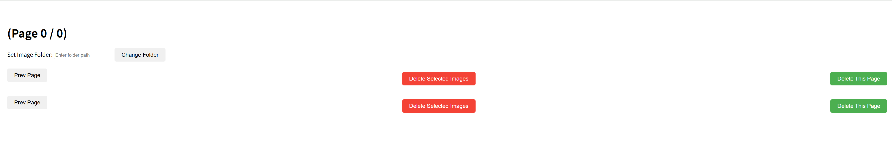
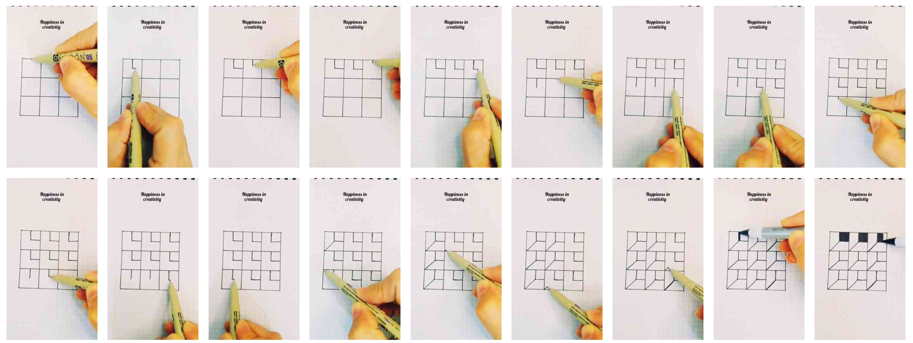
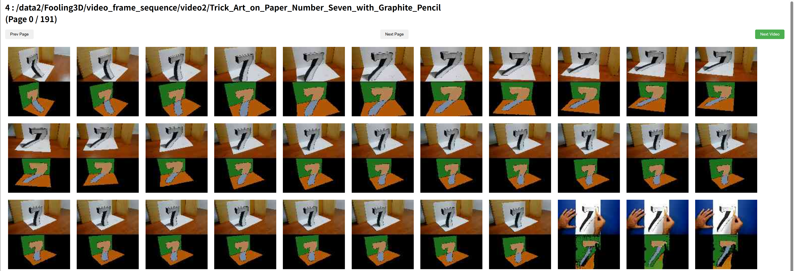
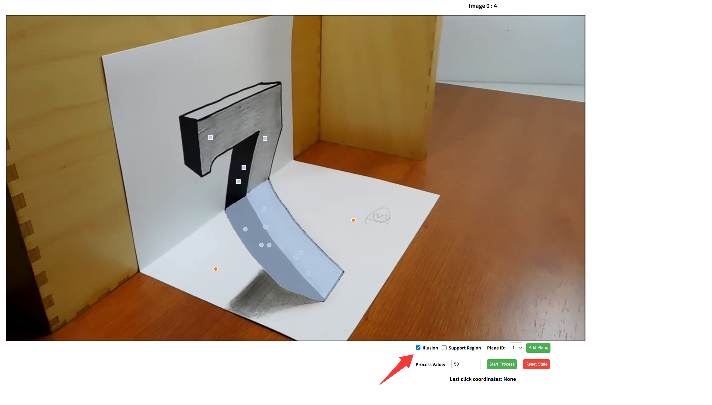
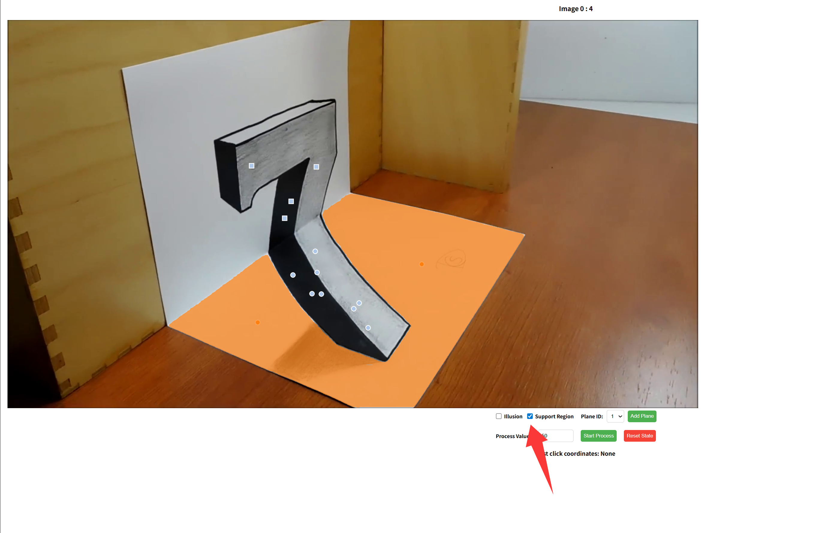
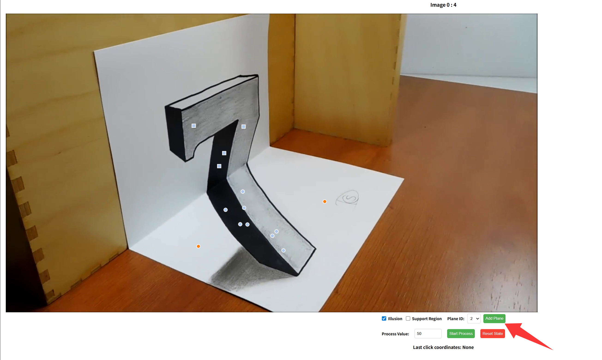
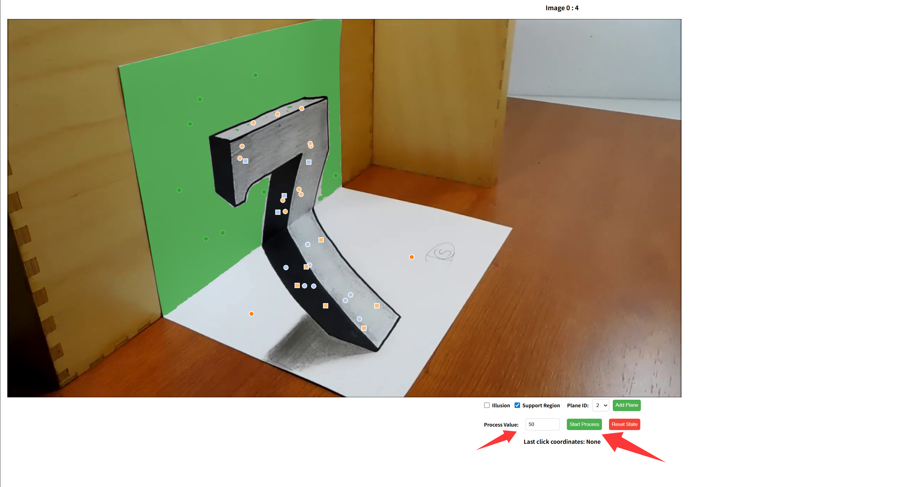

# StereoSimulator
StereoSimulator is a tool designed to generate the right view image from a monocular video. It enables users to manually annotate illusion regions and their corresponding support areas. Using post-processing, the simulator generates the right view based on the left view, annotated mask, and monocular depth estimation.

## Video Collection and Processing
For the collected monocular video, you need to split it into multiple frames and store them in a designated folder.

You can use the following script to delete images that do not contain any illusion region:
```shell
cd scripts/my_image_manager
python app.py -p [port_number]
```
After entering `[ip]:[port_number]` in your browser, you will see the following page:



Enter the folder path and click the `Change Folder` button:

Next, use your mouse to drag and select the images. Click the red `Delete Selected Images` button to remove the selected images.


## Monocular Depth Estimation
We use DepthAnything V2 to estimate the monocular depth of images. Please refer to the following command:
```shell
./utils/prepare_depth_depthAnything.py
```

## Mask Annotation
We use SAM V2 for manually annotating the `illusion` regions and their corresponding `support` regions.

```shell
cd sam2\flask
python app_v2.py -p [port_number]

# Modify the paths in lines 61 and 62
# root = '/data2/Fooling3D/video_frame_sequence'
# sv_root= "/data2/Fooling3D/sam_mask_new/sam_mask"
```

After entering `[ip]:[port_number]` in your browser, you will see the following page:




Click on the image you want to process and select ``illusion``. Left-click to add regions, and right-click to remove regions:


Select ``support`` and click to mask the support regions:


Click ``Add Plane`` to add other pages:


Enter the number of images you want to process and click ``Start Process`` to begin:


At any point, if you want to reset the annotations, click ``Reset State`` to clear the current progress.

If you need to reprocess images that were not correctly annotated, click to reprocess them. After processing all frames, click ``Next Video`` to proceed to the next video:


## Post Processing

Use the following script to process the raw monocular depth estimated by DepthAnything V2:
```shell
cd utils
python depth_post_processing.py

# On the first run, you need to modify the paths and create the .pkl file by update_meta _data function at line 899
# image_root = "/data2/Fooling3D/video_frame_sequence_beta"
# mask_root  = "/data2/Fooling3D/sam_mask_beta"
# depth_root = "/data5/fooling-depth/depth"
# meta_root  = "/data2/Fooling3D/meta_data"
```

You can generate the right view image using the following script:
```shell
cd utils
python right_image_generation.py


# Modify the paths as needed
#image_root = "/data2/Fooling3D/video_frame_sequence"
#mask_root  = "/data2/Fooling3D/sam_mask"
#depth_root = "/data5/fooling-depth/depth"
#meta_root  = "/data2/Fooling3D/meta_data"
#log_root   = "/data5/yao/runs/log"
```

## 3DVisualIllusion Evaluation Scripts
We provide a script to evaluate both disparity from stereo-matching methods and depth from monocular methods.

```shell
cd illusion_eval
bash eval.sh

# Modify the following paths as needed:
# export data_path=/data2/Fooling3D/real/test/left
# export gt_path=/data2/Fooling3D/real/test/disp
# export pred_path=/data3/jiaxi/workspace_bak/workspace/StereoSimulator/eval_data_fooling3d
# export output_path=/data3/jiaxi/workspace_bak/workspace/StereoSimulator/eval_data_fooling3d1
```

You need to place the results of the method you want to compare in the specified pred_path directory beforehand. You can also choose the pred_type and the alignment strategy between the ground truth and the predicted results.